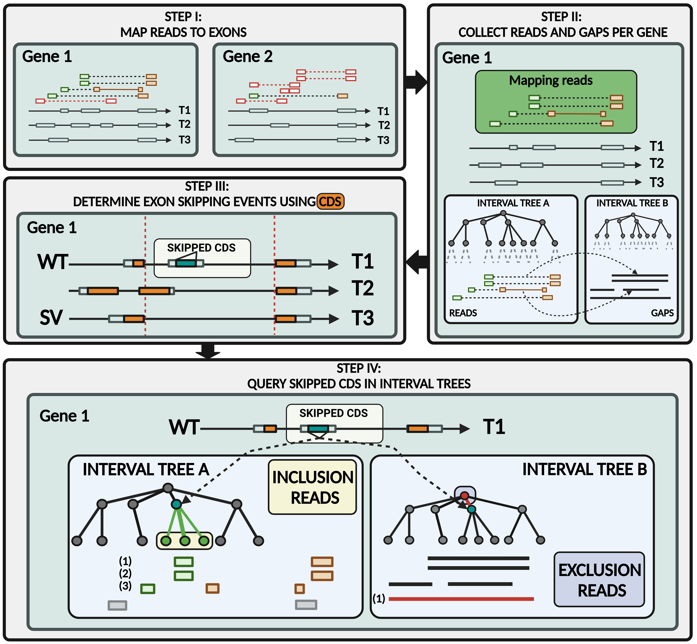

# Alternative Splicing
**Alternative splicing** is a fundamental cellular mechanism with a significant impact
on regulatory processes and gene products. During this process, the **exons** of a
transcript are partially skipped or rearranged. This process is mediated by the **spliceosome**.

The following describes a program developed for the quantification of **skipped exon
events**. Its results are evaluated using a hypothesis test. The program was run on
ten **bam** files using **annotation_b37.gtf** as the reference genome. Additionally,
the results are compared to a previously published tool (**DEXSeq**, from [Anders
et al., 2012](https://doi.org/10.1038/nprot.2012.016)).


## Usage

```sh
java -jar psi.jar -bam <bam> 
                  -gtf <gtf> 
                  -o <out.psi>

```

## Logic


*Figure created using BioRender ([BioRender, 2024](https://BioRender.com)).*

## Percent Spliced-In Value

$$
PSI := \frac{IRC}{IRC + ERC}
$$

Where *IRC* are `inclusion read counts` and *ERC* are *excluding read counts*.
